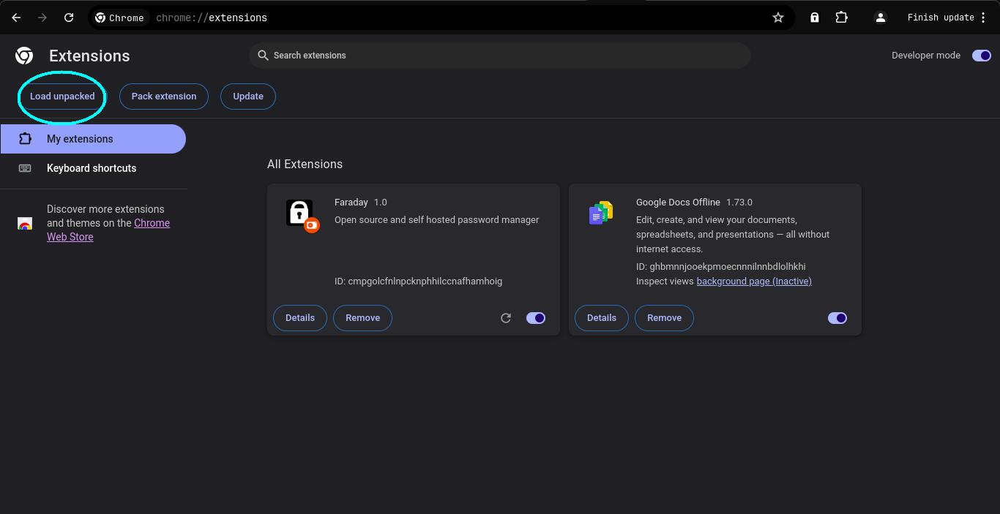

# Faraday

## Getting Started

### Installation

#### Chrome Web Store

Faraday is available from the Chrome Web Store. It can be downloaded from [this](https://chromewebstore.google.com/detail/faraday/ejgajncemnmaimdoibpdjboegdbldfbp) link. **Note:** as of August 19, 2024, the Chrome Web Store version should not be used and is unsecured.

#### Building from source (recommended)

To build from source run the following commands.

```bash
# Download code
git clone https://github.com/Faraday-PM/faraday-frontend

# Install packages
npm i

# Build
npm run build
```

This creates a folder `build/` where the code is kept.

Type `chrome://extensions` in your URL bar. From there click on load unpacked as shown below.



Select the folder you built the code into.

Voila! Now you've loaded the extension. Go through onboarding and enjoy Faraday!

## Count Lines of Code 
``bash
wc -l src/**/*.{svelte,ts,html,json,css}
``
